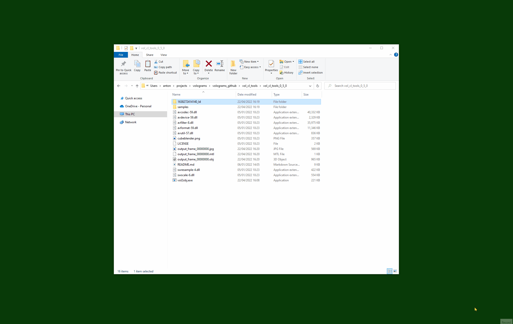

# vol_cl_tools
Command-line tools for converting [Volograms](https://www.volograms.com/)' 3D format.

The most common use of these tools is to convert 3D captures of people made with the [Volu](https://www.volograms.com/volu) phone app into
a common 3D model format (Wavefront .obj) so that you can import it in Unity 3D game projects, use for 3D printing, or in other creative projects.

Tools can be built and run for GNU/Linux, macOS, and Microsoft Windows environments.

## Quick-Start - Turn a *Volu* Capture into a 3D Model You Can Use

There is a video tutorial available now [How to covert Volograms to .obj files](https://youtu.be/PJ8_ZCduqLY).

### Get the vol2obj Tool

* Get the *vol2obj* tool by downloading a [release](https://github.com/Volograms/vol_cl_tools/releases) (Windows),
* or by [compiling it](#compiling-the-tools) (other operating systems).

### Get a Vologram You Have Captured Off Your Phone

* In *Volu* select a Vologram, and find the *Export* button under the *...* menu.
* On the computer you have *vol2obj*, download and unzip the Vologram.
* Put it in the same folder as the *vol2obj* tool so that it is easy to find.
* Newer Volograms will comprise a single *.vols* file. Older Volograms will be a folder containing *header.vols*, *sequence.vols*, and *texture_...* video files.

### Convert a Vologram Frame to .obj

The *vol2obj* tool can handle single file and multi-file versions of Volograms.
The following examples use Windows `vol2obj.exe`. For Linux/macOS substitute `./vol2obj.bin`.

* For Windows users, you can quickly output just the first frame of a Vologram by dragging a single-file Vologram, or a folder containing a multi-file Vologram, onto `vol2obj.exe`.



* To use the command-line for the same:

```
./vol2obj.exe -c my_Vologram.vols --output_dir my_first_capture
```

* For multi-file Volograms, run *vol2obj* and point it to your Vologram's header, sequence, and texture files.
e.g. if your Vologram capture is in a folder called `1625575284206_ld` and that is in the same directory as the *vol2obj* program:

```
./vol2obj.exe -h 1625575284206_ld/header.vols -s 1625575284206_ld/sequence_0.vols -v 1625575284206_ld/texture_2048_h264.mp4 --output_dir my_first_capture
```

Or just the directory, and let it find the files within:

```
./vol2obj.exe 1625575284206_ld --output_dir my_first_capture
```

* This will create a directory called `my_first_capture` containing the first frame of your Vologram sequence as the following files:

```
output_frame_00000000.jpg  -- JPEG texture.
output_frame_00000000.mtl  -- Wavefront MTL material file.
output_frame_00000000.obj  -- Wavefront OBJ mesh file. 
```

### Import the .obj into 3D Software

You can import or drag-and-drop this into most 3D software and 3D game engines.

* In [Blender](https://www.blender.org/) *File->Import->Wavefront (.obj)* and navigate to the .obj in your `my_first_capture` directory. If *Image Search* is ticked it should also find the texture image.
* In [Unity](https://unity.com/) right click in the *Assets* pane and *Import New Asset*. Select the .obj and matching .jpg from `my_first_capture`. Drag the new model into the *Scene* pane. Then drag the new texture onto the model in the scene to apply it.

### Tips

* Some operating systems now have 3D previewers for .obj files built in, so you may even get a 3D render if you click on the `.obj` file.
* For more details on parameters to help extracting frames with *vol2obj* run `--help` from the command line.
* To avoid mixing up files between captures:
  * Create a new output directory using `--output_dir` for each capture you process.
  * You can add a `--prefix` to change `output_frame_` to some more specific file text.
  * Keep each capture's files together in their unique folder. You can rename this to a more meaningful name e.g. from `1625575284206_ld/` to `martial_arts_pose/`.

## Repository Contents ##

| Tool    | Version | Description                                                                                          |
|---------|---------|------------------------------------------------------------------------------------------------------|
| vol2obj | 0.8.0   | Convert a frame from a Vologram sequence to a Wavefront `.obj` file + `.mtl` material + `.jpg` file. |
| cutvols | 0.3.0   | Cut a sequence of frames from a Vologram into a new, shorter, Vologram sequence.                     |

Further tools to be added: obj2vol, and manipulation tools to e.g. strip out normals, or change internal texture formats.

```
lib/                 -- Core Vologram processing libraries from [vol_libs](https://github.com/Volograms/vol_libs) repository.
samples/             -- Simple example Volograms;
samples/cone_hdr.vol -- Vologram header for a 1-frame 3D cone.
samples/cone_seq.vol -- Vologram sequence for the 1-frame 3D cone.
samples/counter.mp4  -- Video texture of numbered frames, useful for debugging.
samples/counter.webm -- A WebM VP9 encoding of the same video texture, for comparison.
samples/cube_hdr.vol -- Vologram header for a 1-frame 3D cube.
samples/cube_seq.vol -- Vologram sequence for the 1-frame 3D cube.
samples/quad_hdr.vol -- Vologram header for a 1-frame 3D rectangle.
samples/quad_seq.vol -- Vologram sequence for the 1-frame 3D rectangle.
third_party/         -- Third-party libraries used by tools.
tools/cutvols/       -- The Vologram sequence cutting tool.
tools/vol2obj/       -- The vol2obj converter tool.
LICENSE              -- Licence details for this project.
Makefile             -- GNU Makefile to build tools with Clang or GCC.
README.md            -- This file.
```

## Compiling the Tools

* Make sure that Git is installed on your system.
* Clone this repository.
* Install FFmpeg development libraries:
    * For Windows these can be found under the `thirdparty/ffmpeg/` sub-directory, and you don't need to do anything.
    * On Ubuntu `sudo apt-get install build-essential clang libavcodec-dev libavdevice-dev libavformat-dev libavutil-dev libswscale-dev`
    * On macOS `brew install ffmpeg`.

* To build vol2obj tool with Clang:

```
make
```

* To build cutvols tool (*nix only):
    * Install dependencies CMake, FFmpeg, and Boost libraries. e.g. on Debian or Ubuntu: `sudo apt-get update && sudo apt-get install --no-install-recommends cmake ffmpeg libboost-all-dev`.
    * Invoke CMake then compile:

```
cd tools/cutvols/
mkdir -p build/ && cd build/
cmake ..
make
```

* Usage instructions for cutvols are commented at the top of the [main.cpp](https://github.com/Volograms/vol_cl_tools/blob/main/tools/cutvols/main.cpp) file.

### Troubleshooting

Homebrew on M1 Macs may require environment variables to be set:

```
export CPATH=/opt/homebrew/include
export LIBRARY_PATH=/opt/homebrew/lib
```

There is a more detailed answer at https://apple.stackexchange.com/questions/414622/installing-a-c-c-library-with-homebrew-on-m1-macs

### Examples

* Convert the first 5 frames (0 to 4, inclusive) from a Vologram in directory `..\1625472326152_ld\` to numbered .objs:

```
vol2obj.exe -f 0 -l 4 --output_dir range -h ..\1625472326152_ld\header.vols -s ..\1625472326152_ld\sequence_0.vols -v ..\1625472326152_ld\texture_2048_h264.mp4
```

* Convert all the frames from a Vologram:

```
vol2obj.exe --all --output_dir all_my_frames -h ..\1625472326152_ld\header.vols -s ..\1625472326152_ld\sequence_0.vols -v ..\1625472326152_ld\texture_2048_h264.mp4
```

* Convert only frame 12 from a Vologram:

```
vol2obj.exe -f 12 --output_dir only12 -h ..\1625472326152_ld\header.vols -s ..\1625472326152_ld\sequence_0.vols -v ..\1625472326152_ld\texture_2048_h264.mp4
```

In this last case the output in the terminal shows us that it has written the following files into the directory we asked for:

```
vol2obj.exe -f 12 --output_dir only12 -h ..\1625472326152_ld\header.vols -s ..\1625472326152_ld\sequence_0.vols -v ..\1625472326152_ld\texture_2048_h264.mp4

Created directory `only12/`
Using output directory = `only12/`
Converting
  frames                 12-12
  header                `..\1625472326152_ld\header.vols`
  sequence              `..\1625472326152_ld\sequence_0.vols`
  video texture `..\1625472326152_ld\texture_2048_h264.mp4`
Wrote mesh file `only12/output_frame_00000012.obj`
Wrote material file `only12/output_frame_00000012.mtl`
Wrote image file `only12/output_frame_00000012.jpg`
Vologram processing completed.
```

For a full list of command-line parameter options run with `--help`.

## Security and Fuzzing

* The core code in this repository has been fuzzed using [AFL](https://github.com/google/AFL).
* Third-party image writing code has not been fuzzed yet, and should not be considered secure at this stage, for use in internal asset pipelines, but of course is fine for test or hobby use.

## Licence ##

Copyright 2023-2021, Volograms.
The MIT License. See the `LICENSE` file for details.

### Dependencies

* This software uses the unaltered transcoder from [Basis Universal](https://binomialllc.github.io/basis_universal/) by [Binomial](http://www.binomial.info/). The transcoder, in turn, uses some code under zlib and BSD (Zstandard). The supported texture formats are [open Khronos Group standards](https://www.khronos.org/registry/DataFormat/specs/1.1/dataformat.1.1.html).

>    Licensed under the Apache License, Version 2.0 (the "License");
>    you may not use this file except in compliance with the License.
>    You may obtain a copy of the License at
> 
>        http://www.apache.org/licenses/LICENSE-2.0
> 
>    Unless required by applicable law or agreed to in writing, software
>    distributed under the License is distributed on an "AS IS" BASIS,
>    WITHOUT WARRANTIES OR CONDITIONS OF ANY KIND, either express or implied.
>    See the License for the specific language governing permissions and
>    limitations under the License.

* This software uses unaltered code of <a href=http://ffmpeg.org>FFmpeg</a> licensed under the <a href=http://www.gnu.org/licenses/old-licenses/lgpl-2.1.html>LGPLv2.1</a> and its source code can be found at [github.com/FFmpeg/FFmpeg](https://github.com/FFmpeg/FFmpeg).

See the `thirdparty/ffmpeg/LICENSE.md` file for details.

* The LGPL build of Windows FFmpeg included in this repository uses the binary of the H264 codec [openh264](https://github.com/cisco/openh264) from Cisco, which has the BSD-2-Clause Licence.

> Copyright (c) 2013, Cisco Systems
> All rights reserved.
> 
> Redistribution and use in source and binary forms, with or without modification,
> are permitted provided that the following conditions are met:
> 
> * Redistributions of source code must retain the above copyright notice, this
>   list of conditions and the following disclaimer.
> 
> * Redistributions in binary form must reproduce the above copyright notice, this
>   list of conditions and the following disclaimer in the documentation and/or
>   other materials provided with the distribution.
> 
> THIS SOFTWARE IS PROVIDED BY THE COPYRIGHT HOLDERS AND CONTRIBUTORS "AS IS" AND
> ANY EXPRESS OR IMPLIED WARRANTIES, INCLUDING, BUT NOT LIMITED TO, THE IMPLIED
> WARRANTIES OF MERCHANTABILITY AND FITNESS FOR A PARTICULAR PURPOSE ARE
> DISCLAIMED. IN NO EVENT SHALL THE COPYRIGHT HOLDER OR CONTRIBUTORS BE LIABLE FOR
> ANY DIRECT, INDIRECT, INCIDENTAL, SPECIAL, EXEMPLARY, OR CONSEQUENTIAL DAMAGES
> (INCLUDING, BUT NOT LIMITED TO, PROCUREMENT OF SUBSTITUTE GOODS OR SERVICES;
> LOSS OF USE, DATA, OR PROFITS; OR BUSINESS INTERRUPTION) HOWEVER CAUSED AND ON
> ANY THEORY OF LIABILITY, WHETHER IN CONTRACT, STRICT LIABILITY, OR TORT
> (INCLUDING NEGLIGENCE OR OTHERWISE) ARISING IN ANY WAY OUT OF THE USE OF THIS
> SOFTWARE, EVEN IF ADVISED OF THE POSSIBILITY OF SUCH DAMAGE.

* This software uses stb_image_write by Sean Barrett to output texture images. This software is used here under the terms of the MIT License "ALTERNATIVE A":

> ALTERNATIVE A - MIT License
> Copyright (c) 2017 Sean Barrett
> Permission is hereby granted, free of charge, to any person obtaining a copy of
> this software and associated documentation files (the "Software"), to deal in
> the Software without restriction, including without limitation the rights to
> use, copy, modify, merge, publish, distribute, sublicense, and/or sell copies
> of the Software, and to permit persons to whom the Software is furnished to do
> so, subject to the following conditions:
> The above copyright notice and this permission notice shall be included in all
> copies or substantial portions of the Software.
> THE SOFTWARE IS PROVIDED "AS IS", WITHOUT WARRANTY OF ANY KIND, EXPRESS OR
> IMPLIED, INCLUDING BUT NOT LIMITED TO THE WARRANTIES OF MERCHANTABILITY,
> FITNESS FOR A PARTICULAR PURPOSE AND NONINFRINGEMENT. IN NO EVENT SHALL THE
> AUTHORS OR COPYRIGHT HOLDERS BE LIABLE FOR ANY CLAIM, DAMAGES OR OTHER
> LIABILITY, WHETHER IN AN ACTION OF CONTRACT, TORT OR OTHERWISE, ARISING FROM,
> OUT OF OR IN CONNECTION WITH THE SOFTWARE OR THE USE OR OTHER DEALINGS IN THE
> SOFTWARE.
